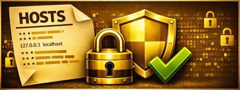
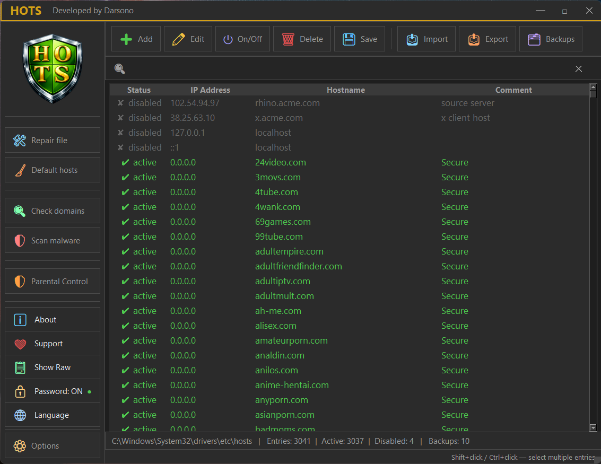
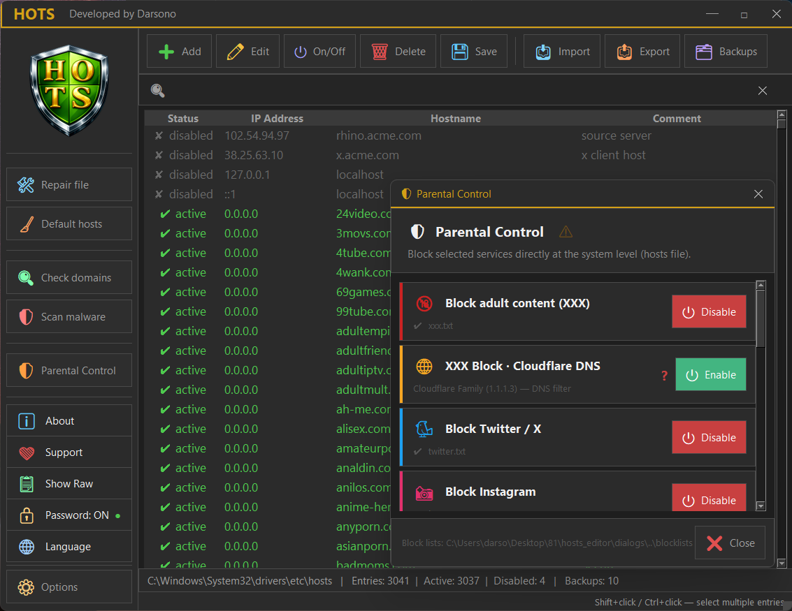
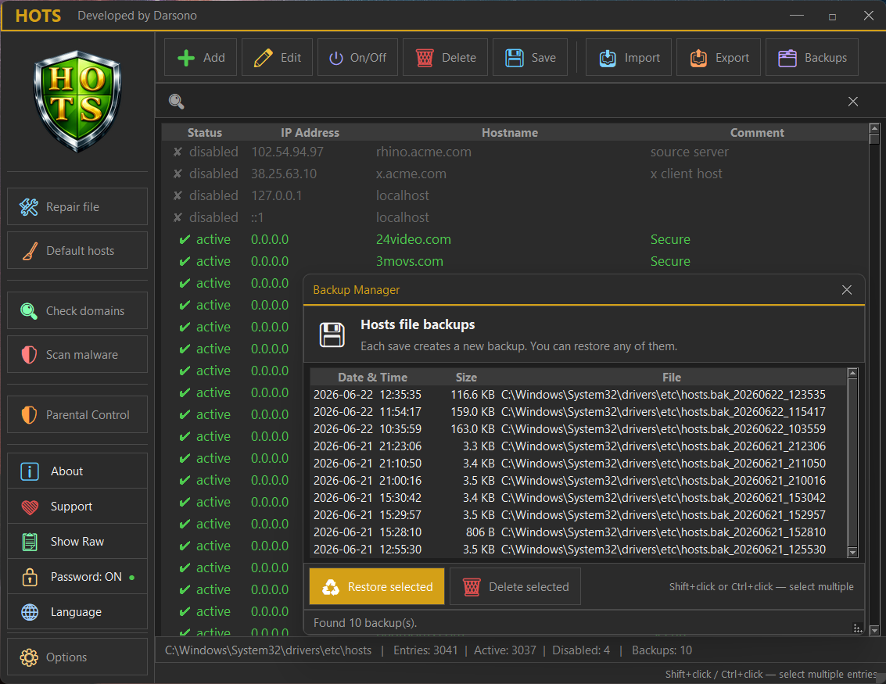

<div align="center">



# HOTS — Windows Hosts File Editor v1.1

**A powerful, dark-themed desktop application for managing the Windows hosts file.**

[](https://www.gnu.org/licenses/gpl-3.0)
[](https://github.com/)
[](https://python.org)
[](#-multilingual-support)

### 📥 [⬇️ Download HOTS_setup.exe](https://github.com/darsono6/HOTS/releases/latest/download/HOTS_setup.exe) &nbsp;·&nbsp; [⬇️ Download HOTS.exe (portable)](https://github.com/darsono6/HOTS/releases/latest/download/HOTS.exe)

</div>

---

## 📋 Overview

HOTS is a lightweight, feature-rich Windows application that lets you view, edit, and manage the system `hosts` file through a clean dark-themed GUI — no more manually navigating to `C:\Windows\System32\drivers\etc\` and fighting with Notepad permissions.

Built as a personal hobby project, released free under **GPLv3**.

---

## 📸 Screenshots

<div align="center">



*Main window — table view with live search and entry management*

<br/>



*Parental Control — category blocklists with Cloudflare Family DNS toggle*

<br/>



*Backup Manager — browse, restore, or delete rotating backups*

</div>

---

## ✨ Features

### Core editing
- 📄 **Real-time table view** of all hosts entries — active, disabled, and comments
- ➕ **Add / Edit / Delete** entries with a polished dialog
- ⏻ **Enable / Disable** entries without deleting them (toggles the `#` prefix)
- 🔍 **Live search & filter** across IP, hostname, and comment columns
- 📋 **Bulk paste** — paste multiple `IP hostname` lines at once
- 🔃 **Column sorting** by any field

### Safety & backups
- 💾 **Auto-backup before every save** — rotating archive of the last 10 backups
- 🗂 **Backup Manager** — browse, restore, or delete any backup
- 👁 **Diff preview** — see exact line-by-line changes before writing to disk
- ✅ **Post-save verification** — confirms the file was written correctly
- 🔒 **20 000 entry limit** — blocks saves that would freeze Windows DNS Client

### Import / Export
- 📥 **Import** any hosts-format `.txt` file
- 📤 **Export** to `.txt` (hosts format) or `.csv` (with Status, IP, Hostname, Comment columns)

### Diagnostics
- 🔍 **Domain existence check** — queries Google DNS (8.8.8.8) directly, bypassing the local hosts file; flags domains that no longer exist in DNS
- 🛡 **Malware scanner** — detects 6 risk patterns:
  - Known system/payment domains redirected to non-loopback IPs
  - Windows Update / antivirus update domains being blocked
  - Entries redirecting to public IPs
  - Mass-redirect patterns (many domains → one IP)
  - Cyrillic homoglyph characters in hostnames
  - Hostnames that are raw IP addresses

### Parental Control
- 🛡 Built-in blocklist manager for 14 categories:
  - 🔞 Adult content · 🐦 Twitter/X · 📸 Instagram · ▶ YouTube · 👤 Facebook
  - 💬 WhatsApp · 🎵 TikTok · 🎮 Twitch · 👻 Snapchat · 📌 Pinterest
  - 🤖 Reddit · 🕹️ Games · 🛡 Windows AntiSpy · ⛔ Torrent
- Each category uses unique section tags — categories never overwrite each other
- Toggle any category on/off with one click; DNS cache flushed automatically
- 🌐 **Cloudflare Family DNS** — one-click enforcement of DNS-level adult content blocking (1.1.1.3 / 1.0.0.3):
  - Automatically detects all active (`Connected`) network interfaces via `netsh`
  - Backs up original DNS settings per interface to `%APPDATA%\HOTS\dns_backup.json` before switching
  - Restores previous DNS (or falls back to DHCP) when Parental Control is disabled
  - State persists across HOTS sessions — DNS remains protected even after the app is closed
  - Works correctly regardless of Windows UI language (handles both English and Polish `netsh` output)

### Windows AntiSpy
- 🛡 **One-click Windows telemetry blocker** — reduces data sent to Microsoft without third-party tools:
  - **Disables two telemetry services:** `DiagTrack` (Connected User Experiences and Telemetry) and `dmwappushservice` (WAP Push Message Routing)
  - **Blocks three system binaries** via Windows Firewall outbound rules: `CompatTelRunner.exe`, `devicecensus.exe`, `WerFault.exe`
  - **Sets** `AllowTelemetry = 0` in `HKEY_LOCAL_MACHINE\SOFTWARE\Policies\Microsoft\Windows\DataCollection`
- Before making any changes, the original state of all services and the registry value is saved to `%APPDATA%\HOTS\HOTS_antispy_state.json`
- **Full restore** — disabling AntiSpy reads the backup and returns every service and registry value to its exact pre-HOTS state
- Requires Administrator rights (UAC prompt on launch covers this)
- Intentionally narrow scope — HOTS is not a comprehensive privacy suite; this targets the most impactful telemetry vectors only

### UI & UX
- 🌙 **Full dark theme** — custom titlebar, dark dialogs, dark scrollbars
- 🌐 **3 languages** — English (default), Polish, Français — switch in Options, saved across sessions
- 🔑 **Password protection** — optional SHA-256 hashed startup password stored in Windows Registry
- 📝 **Raw text view** — edit the hosts file directly like Notepad, with syntax highlighting
- 🗃 **Geometry persistence** — remembers window size and position
- 🔧 **File repair** — auto-fixes wildcard entries, removes duplicates and malformed lines
- 🧹 **Restore default** — replaces current hosts with Microsoft's clean default (backup created first)
- 🚀 **Auto-elevation** — requests UAC Administrator rights on launch

---

## 🛡️ Parental Control – Known Limitations

The Parental Control module blocks domains at the system level using the Windows `hosts` file, combined with Cloudflare Family DNS (1.1.1.3 / 1.0.0.3). This approach is effective but has inherent limitations you should be aware of:

### 🌐 The "Moving Target" Problem (TikTok, YouTube, Facebook…)
Large platforms use hundreds of dynamically changing subdomains and CDN endpoints. A blocklist can never be 100% complete at any given moment.
- **Built-in lists are updated with each HOTS release** to keep up with infrastructure changes.
- **You can add missing domains manually** — HOTS is first and foremost a hosts file editor. Map any bypassing domain to `0.0.0.0` directly from the main table.

### ⚠️ Filters Not Working? Disable DNS-over-HTTPS in Your Browser
Modern browsers (Chrome, Firefox, Edge, Opera) include a feature called **Secure DNS / DNS-over-HTTPS (DoH)**. When enabled, the browser sends DNS queries directly to an external encrypted server, **completely bypassing the system hosts file**.

To make HOTS parental filters effective, disable DoH in each browser's privacy/security settings:
- **Chrome / Edge:** Settings → Privacy and security → Security → Use secure DNS → **Off**
- **Firefox:** Settings → Privacy & Security → DNS over HTTPS → **Off**

### 📱 Mobile Devices & VPNs Are Not Covered
The hosts file only affects the Windows PC it runs on. Phones, tablets, and any device using a VPN will not be subject to these rules.


### Option A — Run the `.exe` (recommended)

1. Download `HOTS_setup.exe` (installer) or `HOTS.exe` (portable, no install) from the [**Releases**](../../releases) page
2. Double-click — UAC will prompt for Administrator rights
3. Done. No further setup required.

> **System requirements:** Windows 10 or Windows 11, 64-bit. Windows 7/8/8.1 and 32-bit systems are not supported.

#### ⚠️ "Windows protected your PC" / SmartScreen warning

Since HOTS is a small independent project without a paid code-signing certificate, Windows SmartScreen may show a warning like *"this app isn't commonly downloaded"* the first few times it's downloaded. This is expected and does **not** mean the file is unsafe — it simply means Microsoft hasn't yet built up a download reputation for it (this happens to every new, unsigned `.exe`, regardless of safety).

To proceed:
1. If you see a screen titled **"Windows protected your PC"**, click **More info**, then click **Run anyway**
2. If you see the Edge/browser download warning shown above, click the **"…"** (more actions) menu next to the downloaded file → **Keep** → **Show more** → **Keep anyway**

If you'd rather verify the file yourself first, you can always build it from source instead — see Option B below — or inspect the full source code in this repository.

### Option B — Run from source

**Requirements:** Python 3.10+, `tkinter` (included with Python on Windows), `Pillow` (for the banner image in the Support window)

```bash
pip install pillow
```

```bash
git clone https://github.com/darsono6/hots.git
cd hots
pythonw -m hosts_editor
```

> ⚠️ Must be run as **Administrator** — the hosts file is write-protected by Windows.

---

## 🗂 Project Structure

```
hosts_editor/
├── __main__.py          # Entry point — UAC elevation, password prompt, language init
├── app.py               # Main window (HostsEditor)
├── core.py              # Data logic — parse, save, import/export, DNS, parental control
├── core_antispy.py      # Windows AntiSpy engine — services, firewall rules, registry
├── constants.py         # Theme colors, paths, settings load/save
├── widgets.py           # Reusable UI components — buttons, dark dialogs, titlebar
├── dns_utils.py         # DNS management — active interface lookup, Cloudflare Family DNS orchestration
├── i18n.py              # Multilingual string system (EN / PL / FR)
├── assets/
│   └── banner.png       # Banner image for the Support window
├── blocklists/          # Plain-text domain lists for Parental Control
│   ├── xxx.txt
│   ├── youtube.txt
│   └── ...
└── dialogs/
    ├── entry_dialog.py       # Add / Edit entry form
    ├── diff_dialog.py        # Diff preview before save
    ├── backup_dialog.py      # Backup Manager
    ├── diagnostics_dialog.py # Domain check & malware scan
    ├── parental_dialog.py    # Parental Control panel
    ├── support_dialog.py     # Support / donate window
    └── password_dialog.py    # Set / verify startup password
```

---

## 🌐 Multilingual Support

The interface language can be changed in the **Options → Language** panel.  
The selected language is saved to `%APPDATA%\HOTS\settings.json` and applied on the next launch — including the startup password prompt.

| Code | Language |
|------|----------|
| `en` | English (default) |
| `pl` | Polski |
| `fr` | Français |

All UI strings, dialogs, error messages, column headers, and system comments (e.g. Parental Control entries in the hosts file) are fully translated.

---

## ⚠️ Disclaimer

HOTS is provided in good faith but **without any warranty**.  
The author is **not responsible** for any damage, data loss, system issues, or other consequences resulting from the use of this application.  
Modifying the hosts file affects system-level network resolution — use with care.  
You use this software **at your own risk**.

---

## ❤️ Support

If HOTS saves you time or you simply want to say thanks:

**PayPal:** [paypal.me/darsonodark](https://paypal.me/darsonodark)  

**Support:** hots.support@gmail.com

No registration required. Any amount is appreciated.

---

## 📄 License

[GNU General Public License v3.0](LICENSE)  
© 2026 Darsono
