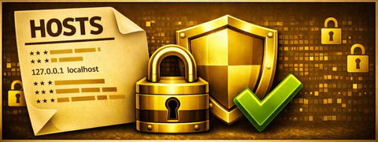
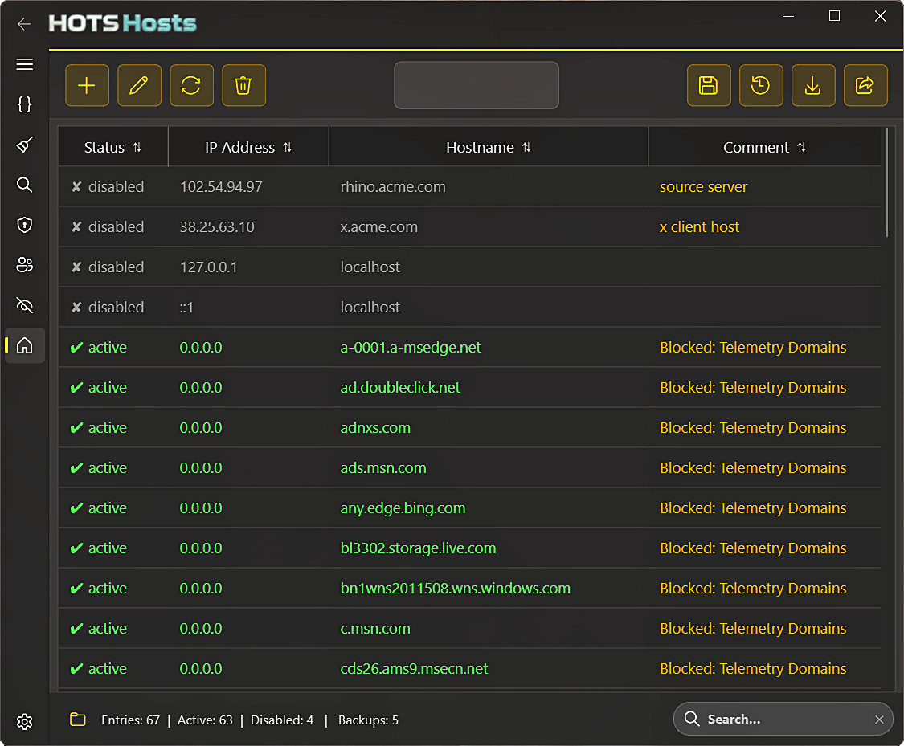
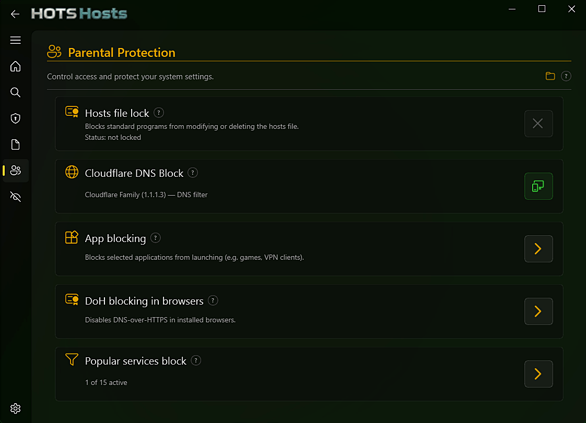
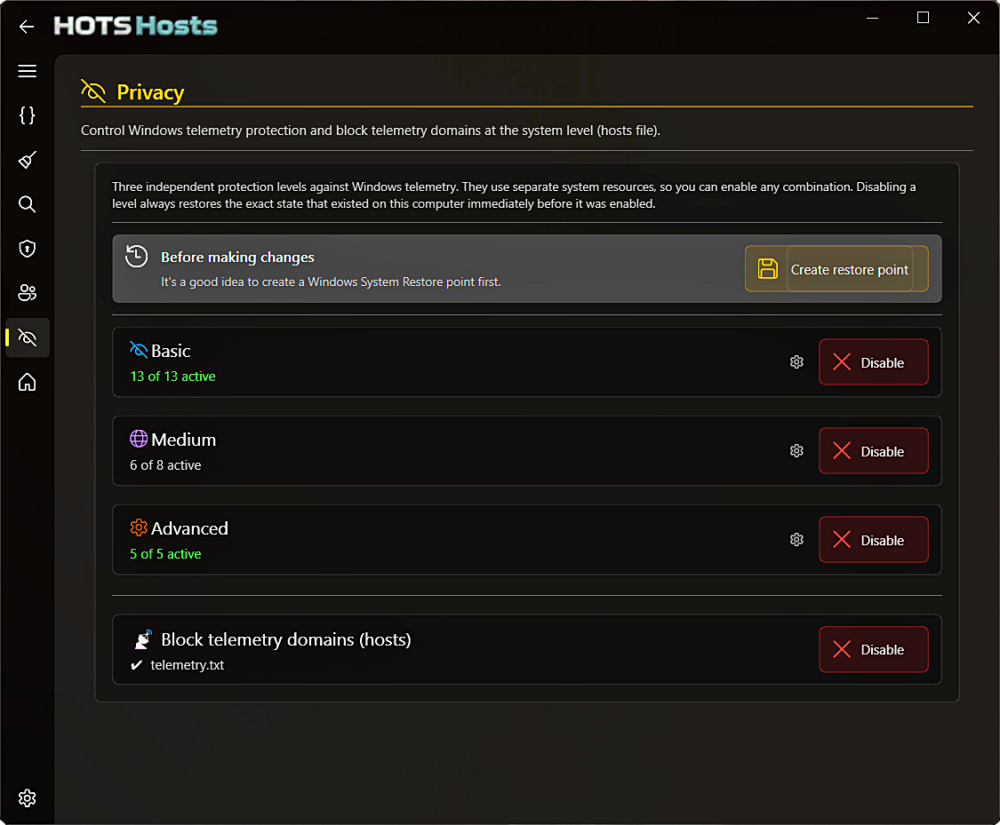

<div align="center">



# HOTS Hosts v2.0

**A Fluent-Design desktop application for managing the Windows hosts file — part of the HOTS Tools family.**

[](https://www.gnu.org/licenses/gpl-3.0)
[](https://github.com/)
[](https://python.org)
[](https://pypi.org/project/PySide6/)
[](#-multilingual-support)

### 📥 [⬇️ Download HOTS_Hosts_setup.exe](https://github.com/darsono6/HOTS/releases/latest/download/HOTS_Hosts_setup.exe) &nbsp;·&nbsp; [⬇️ Download HOTS_Hosts.zip (portable)](https://github.com/darsono6/HOTS/releases/latest/download/HOTS_Hosts.zip)

</div>

---

## 📋 Overview

**HOTS Hosts** is a lightweight, feature-rich Windows application that lets you view, edit, and manage the system `hosts` file through a clean, modern GUI — no more manually navigating to `C:\Windows\System32\drivers\etc\` and fighting with Notepad permissions.

Version 2.0 is a ground-up rebuild: the interface has moved from Tkinter to **PySide6 with Fluent Design (QFluentWidgets)**, bringing a proper light/dark theme, custom accent colors, and a persistent side-navigation layout instead of pop-up dialogs.

HOTS Hosts is the first release under **[HOTS Tools](https://hotstools.com)** — a small line of no-nonsense Windows utilities.

Built as a personal hobby project, released free under **GPLv3**.

---

## 📸 Screenshots

<div align="center">



*Main window — table view with live search and entry management*

<br/>



*Parental Control — category blocklists with Cloudflare Family DNS toggle*

<br/>



*Privacy — tiered telemetry controls with drift detection*

</div>

---

## ✨ Features

### Core editing
- 📄 **Real-time table view** of all hosts entries — active, disabled, and comments
- ➕ **Add / Edit / Delete** entries with a polished dialog
- ⏻ **Enable / Disable** entries without deleting them (toggles the `#` prefix)
- 🔍 **Live search & filter** across IP, hostname, and comment columns
- 📋 **Bulk paste** — paste multiple `IP hostname` lines at once
- 🔃 **Column sorting** by any field

### Safety & backups
- 💾 **Auto-backup before every save** — rotating archive of the last 15 backups
- 🗂 **Backup Manager** — browse, restore, or delete any backup
- 👁 **Diff preview** — see exact line-by-line changes before writing to disk
- ✅ **Post-save verification** — confirms the file was written correctly
- 🔒 **20 000 entry limit** — blocks saves that would freeze Windows DNS Client

### Import / Export
- 📥 **Import** any hosts-format `.txt` file
- 📤 **Export** to `.txt` (hosts format) or `.csv` (with Status, IP, Hostname, Comment columns)

### Diagnostics
- 🔍 **Domain existence check** — queries Google/Cloudflare public DNS directly (in parallel, multi-threaded), bypassing the local hosts file; flags domains that no longer exist in DNS
- 🛡 **Malware scanner** — a heuristic engine covering well over a dozen risk signals, including:
  - Known system/payment domains redirected to a non-loopback IP
  - Windows Update / antivirus update domains being blocked
  - Entries redirecting to a public (non-private, non-loopback) IP
  - Mass-redirect patterns (many domains pointing at the same IP)
  - Hostnames that are raw IP addresses
  - Cyrillic/Unicode homoglyph characters and zero-width characters hidden in a hostname
  - Punycode (`xn--`) hostnames
  - High-entropy, DGA-style hostnames (randomly-generated-looking labels)
  - Typosquatting of well-known domains (fuzzy-matched against a known-safe list)
  - Suspicious TLDs, unusually deep subdomains, and brand-impersonation / long-digit / long-label naming patterns
  - Known-safe subdomains and CDNs are automatically whitelisted to cut down on false positives
  - A per-entry **ignore list** so confirmed-safe results don't keep re-appearing in future scans

### Parental Control
- 🛡 Built-in blocklist manager for 13 categories:
  - 🔞 Adult content · 🐦 Twitter/X · 📸 Instagram · ▶ YouTube · 👤 Facebook
  - 💬 WhatsApp · 🎵 TikTok · 🎮 Twitch · 👻 Snapchat · 📌 Pinterest
  - 🤖 Reddit · 🕹️ Games · ⛔ Torrent
- Each category uses unique section tags — categories never overwrite each other
- Toggle any category on/off with one click; DNS cache flushed automatically
- 🌐 **Cloudflare Family DNS** — one-click enforcement of DNS-level adult content blocking (1.1.1.3 / 1.0.0.3):
  - Detects all active (operationally up) network interfaces natively via the Windows `iphlpapi` API (`GetAdaptersAddresses`) — no `netsh`/PowerShell subprocess is spawned for detection, so it's instant and works identically regardless of Windows display language
  - Backs up original DNS settings per interface to `%APPDATA%\HOTS Hosts\dns_backup.json` before switching
  - Restores previous DNS (or falls back to DHCP) when Parental Control is disabled
  - State persists across HOTS sessions — DNS remains protected even after the app is closed

> ℹ️ The telemetry/tracking-domain blocklist (previously listed as a 14th Parental Control category) now lives under **Privacy**, alongside the other telemetry tweaks — see below.

### 🕵️ Privacy (formerly "Windows AntiSpy")
Completely rebuilt from a single on/off switch into a tiered, granular control center covering **26 individual system tweaks**, organized into three levels:

- **Basic** (13 tweaks) — `AllowTelemetry` policy, `DiagTrack` and `dmwappushservice` services, Windows experimentation/telemetry, advertising ID, Bing/search-box suggestions, tailored experiences, Consumer Features, Delivery Optimization P2P sharing, Windows Recall, feedback notifications, CEIP
- **Medium** (8 tweaks) — firewall rules blocking `CompatTelRunner.exe`, `devicecensus.exe`, `WerFault.exe`, plus disabling scheduled tasks (`Compatibility Appraiser`, `ProgramDataUpdater`, `Consolidator`, `UsbCeip`, `QueueReporting`)
- **Advanced** (5 tweaks) — `WerSvc` / `PcaSvc` services, Activity Feed / Timeline, cross-device activity publishing and upload

Each level shows **"{active} of {total} active"**, and every individual tweak can be expanded, reviewed, and toggled on its own.

- 📡 **Known telemetry domains** — an additional hosts-file blocklist toggle (the domain list formerly surfaced under Parental Control) sits beneath the three tweak levels
- 🩹 **Drift detection** — if Windows resets a protected setting (e.g. after a major update), HOTS flags it with a warning and lets you re-apply it with one click
- 🛟 **System Restore integration** — create a Windows System Restore point with one click before applying changes, plus a one-click option to remove Windows' restore-point creation frequency limit if it's blocking you
- Saves the exact pre-change state before touching anything, so every level can be **fully reverted**
- Requires Administrator rights (UAC prompt on launch covers this)
- Intentionally scoped to the highest-impact, most reliable tweaks — not a comprehensive privacy suite

### 🎨 Appearance
- 🌗 **Light and Dark themes** — switch anytime in Options
- 🎨 **4 accent colors** — Gold, Red, Green, Blue
- 🧭 **Fluent Design navigation** — persistent side panel instead of pop-up dialogs

### 🔄 Updates
- 🔔 **Built-in update checker** — checks GitHub Releases and notifies you when a newer version of HOTS Hosts is available, with a direct link to download it

### UI & UX
- 🌐 **5 languages** — English (default), Polish, Français, Deutsch, Español — switch in Options, saved across sessions
- 🔑 **Password protection** — optional SHA-256 hashed startup password stored in the Windows Registry
- 📝 **Raw text view** — edit the hosts file directly like Notepad, with syntax highlighting
- 🗃 **Geometry persistence** — remembers window size and position
- 🔧 **File repair** — auto-fixes wildcard entries, removes duplicates and malformed lines
- 🧹 **Restore default** — replaces current hosts with Microsoft's clean default (backup created first)
- 🚀 **Auto-elevation** — requests UAC Administrator rights on launch
- 🔂 **Single-instance guard** — launching HOTS Hosts while it's already running switches focus to the existing window instead of opening a duplicate

---

## 🛡️ Parental Control – Known Limitations

The Parental Control module blocks domains at the system level using the Windows `hosts` file, combined with Cloudflare Family DNS (1.1.1.3 / 1.0.0.3). This approach is effective but has inherent limitations you should be aware of:

### 🌐 The "Moving Target" Problem (TikTok, YouTube, Facebook…)
Large platforms use hundreds of dynamically changing subdomains and CDN endpoints. A blocklist can never be 100% complete at any given moment.
- **Built-in lists are updated with each HOTS release** to keep up with infrastructure changes.
- **You can add missing domains manually** — HOTS is first and foremost a hosts file editor. Map any bypassing domain to `0.0.0.0` directly from the main table.

### ⚠️ Filters Not Working? Disable DNS-over-HTTPS in Your Browser
Modern browsers (Chrome, Firefox, Edge, Opera) include a feature called **Secure DNS / DNS-over-HTTPS (DoH)**. When enabled, the browser sends DNS queries directly to an external encrypted server, **completely bypassing the system hosts file**.

To make HOTS parental filters effective, disable DoH in each browser's privacy/security settings:
- **Chrome / Edge:** Settings → Privacy and security → Security → Use secure DNS → **Off**
- **Firefox:** Settings → Privacy & Security → DNS over HTTPS → **Off**

### 📱 Mobile Devices & VPNs Are Not Covered
The hosts file only affects the Windows PC it runs on. Phones, tablets, and any device using a VPN will not be subject to these rules.

---

## ⬇️ Installation

### Option A — Run the `.exe` (recommended)

1. Download `HOTS_Hosts_setup.exe` (installer) or `HOTS_Hosts.zip` (portable, no install) from the [**Releases**](../../releases) page
2. If you downloaded the portable `.zip`, extract it first, then run the `.exe` inside
3. Double-click — UAC will prompt for Administrator rights
4. Done. No further setup required.

> **System requirements:** Windows 10 or Windows 11, 64-bit. Windows 7/8/8.1 and 32-bit systems are not supported.

#### ⚠️ "Windows protected your PC" / SmartScreen warning

Since HOTS Hosts is a small independent project without a paid code-signing certificate, Windows SmartScreen may show a warning like *"this app isn't commonly downloaded"* the first few times it's downloaded. This is expected and does **not** mean the file is unsafe — it simply means Microsoft hasn't yet built up a download reputation for it (this happens to every new, unsigned `.exe`, regardless of safety).

To proceed:
1. If you see a screen titled **"Windows protected your PC"**, click **More info**, then click **Run anyway**
2. If you see the Edge/browser download warning shown above, click the **"…"** (more actions) menu next to the downloaded file → **Keep** → **Show more** → **Keep anyway**

If you'd rather verify the file yourself first, you can always build it from source instead — see Option B below — or inspect the full source code in this repository.

### Option B — Run from source

**Requirements:** Python 3.10+, `PySide6`, `PySide6-Fluent-Widgets`

```bash
pip install PySide6 "PySide6-Fluent-Widgets[full]"
```

```bash
git clone https://github.com/darsono6/HOTS.git
cd HOTS
pythonw -m hosts_editor
```

> ⚠️ Must be run as **Administrator** — the hosts file is write-protected by Windows.

---

## 🗂 Project Structure

```
icon.ico                    # Windows Explorer/shortcut icon
hosts_editor_launcher.pyw   # Single-instance guard + admin elevation entry point (build target)
hosts_editor/
├── __main__.py          # Entry point — UAC elevation, password prompt, language init
├── app.py                # Main window (Fluent navigation shell)
├── core.py               # Data logic — parse, save, import/export, DNS, parental control
├── core_antispy.py       # Privacy engine — services, firewall rules, tasks, registry tweaks
├── core_restore.py       # System Restore point creation & frequency-limit removal
├── constants.py          # Theme colors, accent presets, paths, settings load/save
├── widgets_qt.py         # Reusable Qt/Fluent UI components — buttons, dialogs, pages
├── dns_utils.py          # DNS management — native interface lookup, Cloudflare Family DNS orchestration
├── i18n.py                # Multilingual string system (EN / PL / FR / DE / ES)
├── logo.png / logo.ico / logoS.png / logo1.png
├── blocklists/           # Plain-text domain lists for Parental Control & telemetry blocking
│   ├── adult.txt
│   ├── telemetry.txt
│   ├── youtube.txt
│   └── ...
└── dialogs/
    ├── entry_dialog.py        # Add / Edit entry form
    ├── diff_dialog.py         # Diff preview before save
    ├── backup_page.py         # Backup Manager
    ├── diagnostics_page.py    # Domain check & malware scan
    ├── parental_page.py       # Parental Control panel
    ├── privacy_page.py        # Privacy / telemetry control center
    ├── export_dialog.py       # Export to .txt / .csv
    ├── language_dialog.py     # Language selection
    ├── accent_dialog.py       # Accent color picker
    ├── support_page.py        # Support / donate window
    ├── about_page.py          # About & update checker
    ├── password_dialog.py     # Set / verify startup password
    └── _*.py                  # Shared/internal helpers for the pages above
```

---

## 🌐 Multilingual Support

The interface language can be changed in the **Options → Language** panel.
The selected language is saved to `%APPDATA%\HOTS Hosts\settings.json` and applied on the next launch — including the startup password prompt.

| Code | Language |
|------|----------|
| `en` | English (default) |
| `pl` | Polski |
| `fr` | Français |
| `de` | Deutsch |
| `es` | Español |

All UI strings, dialogs, error messages, column headers, and system comments (e.g. Parental Control entries in the hosts file) are fully translated.

---

## ⚠️ Disclaimer

HOTS Hosts is provided in good faith but **without any warranty**.
The author is **not responsible** for any damage, data loss, system issues, or other consequences resulting from the use of this application.
Modifying the hosts file affects system-level network resolution — use with care.
You use this software **at your own risk**.

---

## ❤️ Support

If HOTS Hosts saves you time or you simply want to say thanks:

**Website:** [hotstools.com](https://hotstools.com)

**PayPal:** [paypal.me/darsonodark](https://paypal.me/darsonodark)

**Support:** hots.support@gmail.com

No registration required. Any amount is appreciated.

---

## 📄 License

[GNU General Public License v3.0](LICENSE.txt)
© 2026 Darsono
