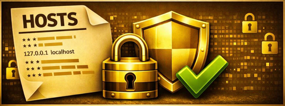
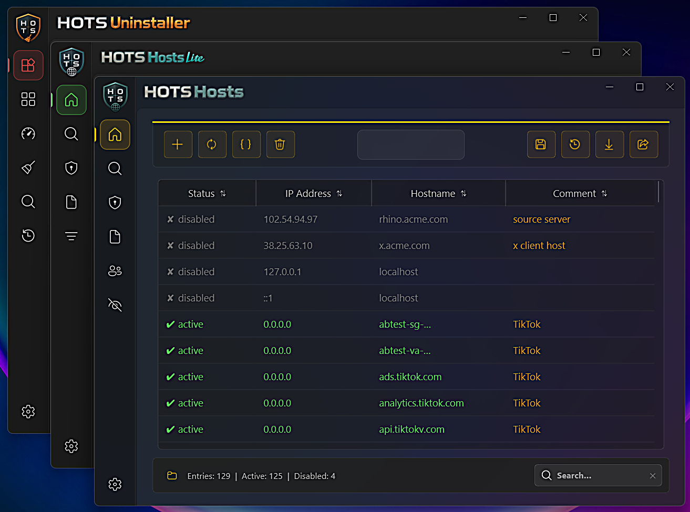
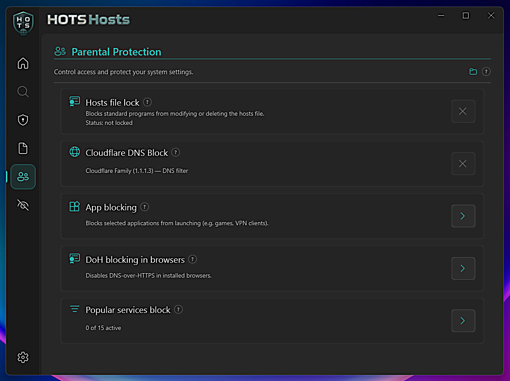
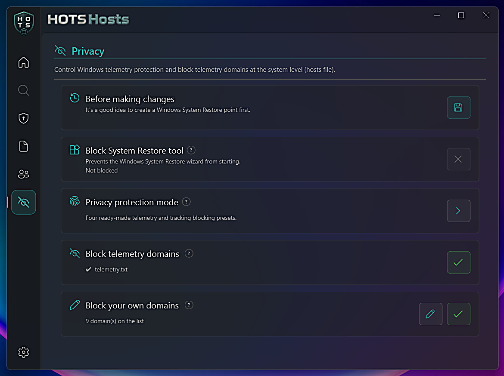
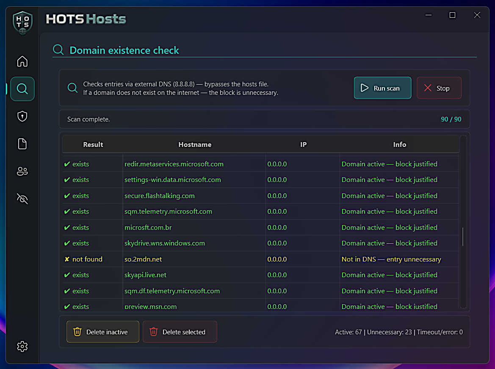
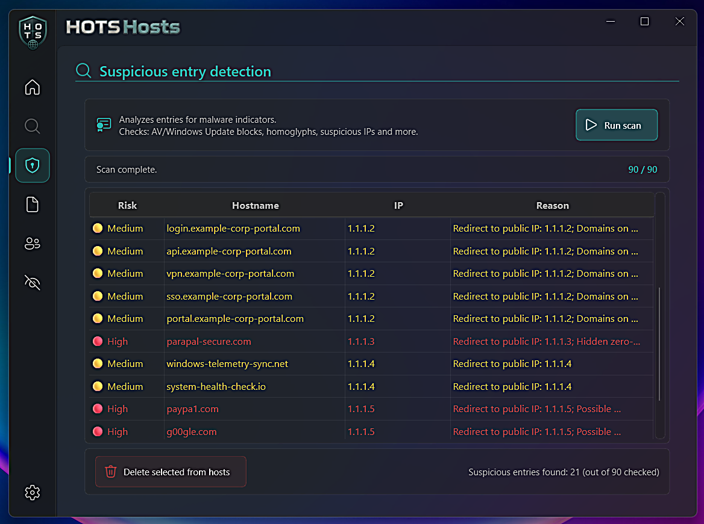

<div align="center">



# HOTS Hosts

**Block distracting apps, protect your kids online, and stop Windows from spying on you — all from one simple app.**

[](https://www.gnu.org/licenses/gpl-3.0)
[](https://github.com/)
[](#language-support)

### 📥 [⬇️ Download for Windows — free](https://github.com/darsono6/HOTS/releases/latest/download/HOTS_Hosts_setup.exe)

*No account, no subscription, no ads. Just download and run.*

</div>

---

## What does it actually do?

Three things, in plain terms:

- 🛡️ **Parental controls** — block TikTok, Instagram, YouTube, adult sites, and more with one click. No router settings, no complicated setup.
- 🔒 **Windows privacy** — turn off the telemetry and tracking Windows collects by default, with one click per setting.
- ✏️ **Hosts file editor** — if you already know what the Windows hosts file is, this gives you a proper table editor for it instead of fighting Notepad and admin permissions.

You don't need to understand *how* any of this works to use it — the app walks you through it.

> **Looking for something simpler?** If you just want to lock down the hosts file with a custom blocklist and don't need parental controls or the privacy/telemetry module, check out **[HOTS Hosts Lite](https://github.com/darsono6/HOTS-Hosts-Lite)** — a smaller, focused sibling.

<div align="center">


<br/><sub>Main window — table view with live search and entry management</sub>

<br/><br/>


<br/><sub>Parental Control — category blocklists with Cloudflare Family DNS toggle</sub>

<br/><br/>


<br/><sub>Privacy — tiered telemetry controls with drift detection</sub>

<br/><br/>


<br/><sub>Diagnostics — "Check domains" scanning entries against public DNS</sub>

<br/><br/>


<br/><sub>Diagnostics — "Scan malware" heuristic engine flagging suspicious entries</sub>

</div>

---

## Getting started

1. **[Download the installer](https://github.com/darsono6/HOTS/releases/latest/download/HOTS_Hosts_setup.exe)**
2. Double-click it — Windows will ask for Administrator permission (that's normal, the app needs it to edit system files)
3. Follow the setup wizard — done

**Requires:** Windows 10 or 11, 64-bit.

### About the Windows warning you might see

Since this is a small independent project without a paid certificate, Windows may show a **"Windows protected your PC"** warning the first time you run it. This is normal for any new app that hasn't built up a download history yet — it does **not** mean anything is wrong with the file.

To continue: click **More info** → **Run anyway**.

If you'd rather double-check the app yourself first, the full source code is right here in this repository — see [Running from source](#running-from-source) below.

See **[CODE_SIGNING.md](CODE_SIGNING.md)** for full details on why the release isn't signed yet and how release builds are produced.

---

## What's new in 2.3

- **Significantly lower resource usage** — the app no longer depends on PySide6-Fluent-Widgets and runs on its own lightweight window and widgets
- **Code optimization** throughout the application
- **A fifth accent color**
- **Refreshed look** and a number of small UI fixes
- **Uninstall wizard** — instead of an all-or-nothing removal, the uninstaller now asks exactly what to undo: domain blocks + DNS-over-HTTPS + Cloudflare Family DNS, Privacy-tools changes, saved configuration, your custom domain list (kept by default), and hosts file backups. Anything left unchecked stays exactly as it was.
- A heads-up before uninstalling: if you're only trying to install a newer version, you don't need to uninstall first — the installer now reminds you of that and lets you back out.
- Reinstalling or updating over an existing install now starts from a clean installation folder, so files removed or renamed between versions no longer pile up on your system.
- Fixed: Cloudflare Family DNS could stay enabled on the network adapter after uninstalling; it's now reverted along with the other domain-blocking configuration if you choose to.

---

## Everything it can do

<details>
<summary><strong>🛡️ Parental Control</strong> — click to expand</summary>

- One-click blocklists for 15 categories: Twitter/X, Instagram, YouTube, Facebook, WhatsApp, TikTok, Twitch, Snapchat, Pinterest, Reddit, adult content, games, torrents, dating sites, random video chat
- **Cloudflare Family DNS** — one click adds DNS-level filtering on top of the blocklists
- **Hosts file lock** — stops the blocklists from being edited or removed by a curious kid (or malware) outside the app
- **Application blocking** — stop specific programs (games, VPN apps) from launching at all
- **VPN client blocking** — blocks 10 popular VPN apps that could otherwise be used to bypass the filters
- **DNS-over-HTTPS blocking** — closes a common loophole where browsers quietly bypass the hosts file for DNS lookups
- **Block System Restore** — stops someone from using System Restore to undo all the blocks

</details>

<details>
<summary><strong>🕵️ Windows Privacy</strong> — click to expand</summary>

37 individual telemetry and tracking settings, grouped into four levels (Basic → Privacy+) so you can go as light or as aggressive as you want. Covers Windows telemetry services, advertising ID, activity history, location tracking, Recall, and more. Every setting can be reviewed and toggled individually, and reverted at any time.

Includes a drift detector that warns you if Windows quietly re-enables something after an update, and one-click System Restore point creation before you make changes.

</details>

<details>
<summary><strong>✏️ Hosts File Editor</strong> — click to expand</summary>

- Table view of all entries, live search, bulk paste, sorting
- Add / edit / delete / enable-disable entries without touching Notepad
- Auto-backup before every save (last 15 kept), with a diff preview before writing
- Import/export `.txt` or `.csv`
- Domain checker — flags entries pointing at domains that no longer exist
- Malware scanner — heuristics for hijacked/suspicious entries (homoglyphs, DGA-style domains, typosquatting, and more)
- Raw text view for anyone who wants to edit the file directly

</details>

<details>
<summary><strong>🎨 Other features</strong> — click to expand</summary>

- Light and dark themes, 5 accent colors, custom window with Mica backdrop on Windows 11
- 7 languages: English, Polski, Français, Deutsch, Español, Português, Русский
- Optional password protection (required to open the app or uninstall it)
- Uninstall wizard — choose exactly what to undo (domain blocks, DNS, privacy settings, saved configuration, custom domain list, hosts backups) instead of an all-or-nothing removal
- Built-in update checker
- Auto-elevation, single-instance guard, window geometry memory

</details>

---

## Good to know before you rely on this

<details>
<summary><strong>Limitations of hosts-file / DNS-based blocking</strong> — click to expand</summary>

- Big platforms (TikTok, YouTube, Facebook) use huge numbers of changing CDN domains — no blocklist is ever 100% complete at every moment. Lists are updated with each release, and you can add your own domains any time.
- Modern browsers can bypass the hosts file entirely via DNS-over-HTTPS — HOTS Hosts closes this at the system policy level as of v2.1, so you don't need to dig through each browser's settings.
- This only affects the Windows PC it's installed on — phones, tablets, and traffic tunneled through a VPN service aren't covered by hosts-file rules (separate from VPN *client* blocking, which stops specific VPN apps from launching on this PC).

</details>

---

## Running from source

<details>
<summary>For developers — click to expand</summary>

**Requirements:** Python 3.10+, `PySide6` and `certifi` (see `requirements.txt`)

```bash
git clone https://github.com/darsono6/HOTS.git
cd HOTS
pip install -r requirements.txt
pythonw hosts_editor_launcher.pyw
```

> Must be run as **Administrator** — the hosts file is write-protected by Windows.

### Project structure

```
hosts_editor_launcher.pyw   # Single-instance guard + admin elevation entry point (build target)
hosts_editor/
├── __main__.py             # Entry point — app startup, password prompt, language init
├── app.py                  # Main window — hosts table, toolbar, page navigation
├── frameless.py             # Custom window shell — title bar, DWM shadow, Mica (Win11), page stack
├── nav_rail.py               # Side navigation rail
├── core.py                  # Data logic — parse, save, import/export, DNS, custom domain blocking
├── core_antispy.py         # Privacy engine — services, firewall rules, tasks, registry tweaks, hosts file lock
├── core_appblock.py       # Application blocking — IFEO redirection + ACL deny on target executables, VPN client bundle
├── core_doh.py               # DNS-over-HTTPS blocking — per-browser Group Policy enforcement + drift watchdog
├── core_restore.py         # System Restore point creation & frequency-limit removal
├── bg_tasks.py               # Background worker thread registry — joined on app quit to avoid Qt teardown races
├── constants.py             # Theme colors, accent presets, paths, settings load/save
├── widgets_qt.py            # Reusable Qt UI components — buttons, dialogs, pages, tooltips
├── ui_parts.py                # Small widgets — icon widget, toolbar button, progress ring, info banner
├── icons.py                   # Built-in SVG icon set
├── resource_utils.py       # Base-path resolution (dev / frozen / Nuitka builds)
├── dns_utils.py              # DNS management — native interface lookup, Cloudflare Family DNS orchestration
├── uninstall_flow.py       # Uninstall cleanup logic — mandatory system-lock teardown + optional, wizard-driven reverts
├── i18n.py                     # Multilingual string system (EN / PL / FR / DE / ES / PT / RU)
├── graphic/
│   ├── logo.png                              # About page logo
│   ├── logo.ico                                # Window/taskbar icon
│   ├── logo1.png                              # Splash screen shown while the app starts
│   ├── logoS.png                              # Small logo — title bar + Support page watermark
│   ├── support_me_on_kofi_dark.png   # Ko-fi donate button on the Support page
│   └── paypal_donate_button.png       # PayPal donate button on the Support page
├── blocklists/                 # Plain-text domain lists for Parental Control & telemetry blocking
│   ├── adult.txt
│   ├── telemetry.txt
│   ├── youtube.txt
│   └── ...
└── dialogs/
    ├── entry_dialog.py           # Add / Edit entry form
    ├── diff_dialog.py             # Diff preview before save
    ├── backup_page.py           # Backup Manager
    ├── diagnostics_page.py    # Domain check & malware scan
    ├── parental_page.py        # Parental Control panel — categories, hosts file lock, app blocking
    ├── privacy_page.py          # Privacy / telemetry control center — restore point tools, custom domains, tiered tweaks
    ├── custom_domains_dialog.py  # Editor for the "Block your own domains" free-text list
    ├── _doh_card.py               # DNS-over-HTTPS blocking card (per-browser toggles + watchdog)
    ├── _appblock_card.py       # Application / VPN client blocking card
    ├── export_dialog.py         # Export to .txt / .csv
    ├── language_dialog.py     # Language selection
    ├── accent_dialog.py        # Accent color picker
    ├── support_page.py         # Support / donate window
    ├── about_page.py            # About & update checker
    ├── password_dialog.py     # Set / verify startup password
    ├── uninstall_wizard.py    # Uninstall-time "what should we undo?" wizard (launched by the installer's uninstaller)
    └── _*.py                        # Shared/internal helpers for the pages above
```

</details>
</details>

---

## Language support

The interface language can be changed in **Options → Language**. All UI strings, dialogs, and system comments are fully translated.

| Code | Language |
|------|----------|
| `en` | English (default) |
| `pl` | Polski |
| `fr` | Français |
| `de` | Deutsch |
| `es` | Español |
| `pt` | Português |
| `ru` | Русский |

---

## Third-party components

- [PySide6](https://doc.qt.io/qtforpython-6/) (Qt for Python) — LGPLv3 / GPLv3
- [certifi](https://github.com/certifi/python-certifi) — MPL 2.0
- Icons: [Fluent UI System Icons](https://github.com/microsoft/fluentui-system-icons) © Microsoft Corporation — MIT (license text kept in `hosts_editor/icons.py`)

---

## Disclaimer

HOTS Hosts is provided in good faith but **without any warranty**. The author is **not responsible** for any damage, data loss, system issues, or other consequences resulting from the use of this application. Modifying the hosts file affects system-level network resolution — use with care. You use this software **at your own risk**.

---

## Security

Found a security issue? Please report it privately rather than opening a public issue — see **[SECURITY.md](SECURITY.md)** for how to report and what's in scope.

---

## Support

If HOTS Hosts saves you time or you simply want to say thanks:

<a href="https://ko-fi.com/darsono"></a>

**Website:** [hotstools.com](https://hotstools.com)
**Ko-fi:** [ko-fi.com/darsono](https://ko-fi.com/darsono)
**PayPal:** [paypal.me/darsonodark](https://paypal.me/darsonodark)
**Support:** hots.support@gmail.com

No registration required. Any amount is appreciated.

---

## License

[GNU General Public License v3.0](LICENSE.txt)
© 2026 Darsono
